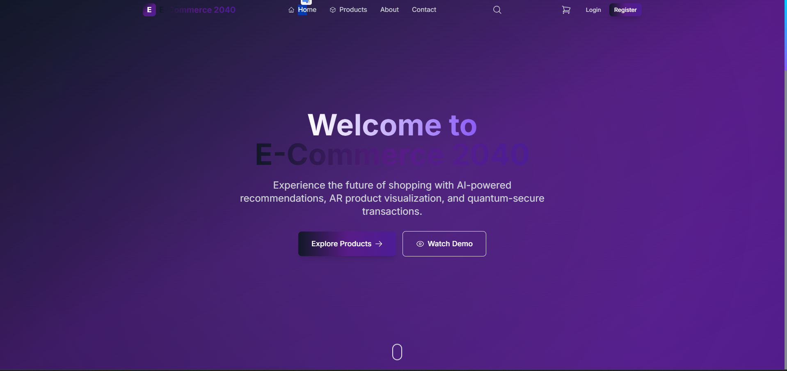
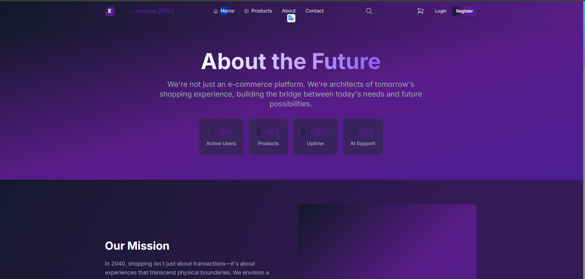
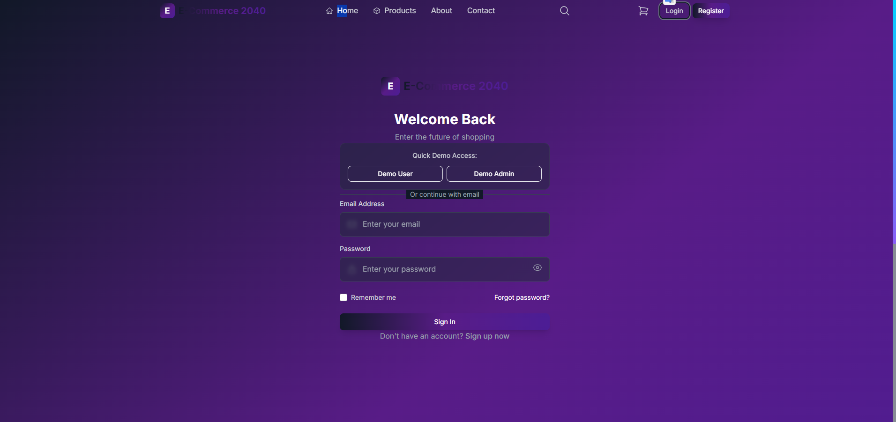
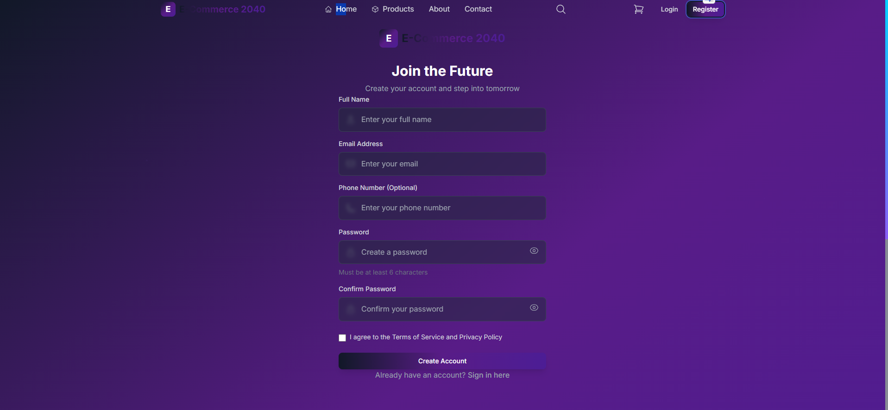

# 🚀 E-Commerce 2040 - Geleceğin Alışveriş Platformu

<div align="center">
  
  
  
  
  
</div>

<div align="center">
  <h3>🌟 Yapay zeka destekli öneriler, AR ürün görselleştirme ve kuantum güvenli işlemlerle geleceğin alışveriş deneyimini yaşayın.</h3>
</div>

---

## 📸 Proje Görselleri

### 🏠 Ana Sayfa

*Modern ve gelecekçi tasarım ile karşılama sayfası*

### ℹ️ Hakkımızda Sayfası  

*Geleceğin vizyonu ve misyonumuz*

### 🔐 Giriş Sayfası

*Güvenli kullanıcı girişi ve demo hesap erişimi*

### 📝 Kayıt Sayfası

*Kullanıcı dostu kayıt formu*

---

## ✨ Özellikler

### 🛍️ **Ürün Yönetimi**
- 🔍 Gelişmiş ürün filtreleme ve arama
- 🏷️ Kategori bazlı ürün gruplandırma
- ⭐ Kullanıcı değerlendirmeleri ve puanlama
- 🎨 Ürün varyantları (renk, boyut, kapasite)
- 📱 AR ürün görselleştirme (gelecek özellik)

### 🛒 **Alışveriş Deneyimi**
- 🛒 Akıllı sepet yönetimi
- 💰 Dinamik fiyatlandırma
- 📦 Sipariş takibi
- 🎯 AI destekli ürün önerileri
- ⚡ Gerçek zamanlı stok kontrolü

### 👤 **Kullanıcı Yönetimi**
- 🔐 Güvenli kimlik doğrulama
- 👥 Kullanıcı ve admin rolleri
- 📊 Kişisel dashboard
- 📋 Sipariş geçmişi
- ⚙️ Profil yönetimi

### 🎨 **Modern UI/UX**
- 🌙 Futuristik dark tema
- 📱 Responsive tasarım
- ⚡ Smooth animasyonlar (Framer Motion)
- 🎭 3D görsel efektler
- 🔮 Neon renk paleti

### 🔧 **Teknoloji Özellikleri**
- ⚡ Vite ile hızlı geliştirme
- 🔄 React Query ile veri yönetimi
- 🗄️ Zustand state management
- 🎪 Headless UI bileşenleri
- 📊 Responsive grid sistem

---

## 🛠️ Teknoloji Stack

### **Frontend**
- ⚛️ **React 18.2** - Modern UI library
- 🎨 **Tailwind CSS** - Utility-first CSS framework
- 🎭 **Framer Motion** - Animasyon library
- ⚡ **Vite** - Next generation frontend tooling
- 🗄️ **Zustand** - Lightweight state management
- 🔄 **React Query** - Data fetching & caching
- 🎪 **Headless UI** - Unstyled, accessible UI components
- 🦸 **Heroicons** - Beautiful hand-crafted SVG icons

### **Backend**
- 🟢 **Node.js** - JavaScript runtime
- 🚀 **Express.js** - Web application framework
- 🔒 **CORS** - Cross-origin resource sharing
- 🆔 **UUID** - Unique identifier generation
- 📝 **JSON** - Data storage (mock database)

### **Development Tools**
- 📦 **npm** - Package management
- 🔍 **ESLint** - Code linting
- 💄 **PostCSS** - CSS processing
- 🔧 **Vite Config** - Build configuration

---

## 🚀 Kurulum ve Çalıştırma

### **Önkoşullar**
- Node.js 18+ 
- npm veya yarn
- Git

### **1. Projeyi İndirin**
```bash
git clone https://github.com/yourusername/e-ticaret-2040.git
cd e-ticaret-2040
```

### **2. Backend Kurulumu**
```bash
cd server
npm install
npm start
```
Backend şu adreste çalışacak: `http://localhost:5000`

### **3. Frontend Kurulumu**
```bash
cd client
npm install
npm run dev
```
Frontend şu adreste çalışacak: `http://localhost:5173`

---

## 🎯 Demo Hesapları

### 👤 **Kullanıcı Hesabı**
- **Email:** `test@example.com`
- **Şifre:** `123456`

### 👨‍💼 **Admin Hesabı**
- **Email:** `admin@example.com`
- **Şifre:** `admin123`

---

## 📚 API Endpoints

### **🔐 Authentication**
- `POST /api/users/login` - Kullanıcı girişi
- `POST /api/users/register` - Kullanıcı kaydı

### **🛍️ Products**
- `GET /api/products` - Tüm ürünleri getir
- `GET /api/products/:id` - Tekil ürün detayı
- `GET /api/products/categories` - Kategorileri getir
- `GET /api/products/search` - Ürün arama

### **🛒 Cart**
- `GET /api/cart` - Sepet içeriği
- `POST /api/cart/add` - Sepete ürün ekle
- `PUT /api/cart/items/:id` - Sepet ürünü güncelle
- `DELETE /api/cart/items/:id` - Sepetten ürün sil

### **📦 Orders**
- `GET /api/orders` - Siparişleri getir
- `POST /api/orders` - Yeni sipariş oluştur
- `GET /api/orders/:id` - Sipariş detayı

### **👨‍💼 Admin**
- `GET /api/admin/stats` - Dashboard istatistikleri

---

## 🗂️ Proje Yapısı

```
e-ticaret-2040/
├── 📁 client/                 # Frontend uygulaması
│   ├── 📁 src/
│   │   ├── 📁 components/     # React bileşenleri
│   │   │   ├── 📁 auth/       # Kimlik doğrulama
│   │   │   ├── 📁 layout/     # Layout bileşenleri
│   │   │   ├── 📁 product/    # Ürün bileşenleri
│   │   │   └── 📁 ui/         # UI bileşenleri
│   │   ├── 📁 pages/          # Sayfa bileşenleri
│   │   │   ├── 📁 auth/       # Giriş/Kayıt sayfaları
│   │   │   ├── 📁 admin/      # Admin sayfaları
│   │   │   └── 📁 user/       # Kullanıcı sayfaları
│   │   ├── 📁 services/       # API servisleri
│   │   ├── 📁 store/          # State management
│   │   ├── 📁 hooks/          # Custom hooks
│   │   └── 📁 utils/          # Yardımcı fonksiyonlar
│   ├── 📄 package.json
│   ├── 📄 vite.config.js
│   └── 📄 tailwind.config.js
├── 📁 server/                 # Backend uygulaması
│   ├── 📁 controllers/        # Route handlers
│   ├── 📁 middleware/         # Middleware functions
│   ├── 📁 models/             # Data models
│   ├── 📁 routes/             # API routes
│   ├── 📁 config/             # Configuration
│   ├── 📄 server.js           # Ana server dosyası
│   └── 📄 package.json
├── 📁 docs/                   # Dokümantasyon
└── 📄 README.md
```

---

## 🌟 Gelecek Özellikler

- 🥽 **AR Ürün Görselleştirme** - Ürünleri gerçek ortamda görme
- 🤖 **AI Chatbot** - 7/24 müşteri desteği
- 🔐 **Blockchain Güvenlik** - Kuantum güvenli işlemler
- 📱 **Mobile App** - React Native uygulaması
- 💳 **Kripto Ödemeler** - Bitcoin, Ethereum desteği
- 🌍 **Çoklu Dil** - Uluslararası destek
- 📊 **Gelişmiş Analytics** - Kullanıcı davranış analizi
- 🚁 **Drone Teslimat** - Otonom teslimat sistemi

---

## 🤝 Katkıda Bulunma

1. 🍴 Fork yapın
2. 🌟 Feature branch oluşturun (`git checkout -b feature/AmazingFeature`)
3. 💾 Değişikliklerinizi commit edin (`git commit -m 'Add some AmazingFeature'`)
4. 📤 Branch'inizi push edin (`git push origin feature/AmazingFeature`)
5. 🎯 Pull Request oluşturun

---

## 📄 Lisans

Bu proje MIT lisansı altında lisanslanmıştır. Detaylar için [LICENSE](LICENSE) dosyasını inceleyin.

---

## 📞 İletişim

- 📧 **Email:** developer@ecommerce2040.com
- 🐦 **Twitter:** [@ecommerce2040](https://twitter.com/ecommerce2040)
- 💼 **LinkedIn:** [E-Commerce 2040](https://linkedin.com/company/ecommerce2040)

---

<div align="center">
  <h3>🚀 Geleceğin Alışverişi Bugün Başlıyor!</h3>
  <p>E-Commerce 2040 ile zaman yolculuğuna çıkın ve yarının teknolojisini bugün deneyimleyin.</p>
  
  **⭐ Projeyi beğendiyseniz yıldız vermeyi unutmayın!**
</div>

---

<div align="center">
  <sub>🔮 2040 yılından selamlar! Bu proje, geleceğin e-ticaret deneyimini bugünden sunar.</sub>
</div>
